# Sentinel AI Stack

[](https://github.com/azfarh95/sentinel-stack-public/stargazers)
[](https://github.com/azfarh95/sentinel-stack-public/blob/master/LICENSE)
[](https://github.com/azfarh95/sentinel-stack-public/commits/master)
[](https://github.com/topics/self-hosted)
[](https://github.com/topics/mcp)
[](https://github.com/topics/telegram-bot)


> **A batteries-included personal AI butler for your home, powered by Claude and local LLMs — controlled entirely from Telegram.**

A self-hosted, two-bot personal AI assistant that runs on your own hardware. Send it a Telegram message and it searches the web, manages your calendar, downloads videos, sets reminders, remembers things across sessions, controls your browser via Playwright, and more — no terminal required, no cloud subscription.

**Version:** see [VERSION](VERSION) · [Changelog](https://github.com/azfarh95/sentinel-stack-public/releases)

## Who this is for

- **Self-hosters** who want a real AI assistant on their own box, not behind a SaaS paywall
- **Windows power users** with WSL2 + Docker + a decent GPU (24 GB VRAM recommended) who want to keep their data local
- **AI tinkerers** who want a polished MCP-driven stack with a real UI (mini app, dashboards, restart buttons) rather than wiring everything from scratch
- **Privacy-conscious users** who want their LLM, memory, calendar reads, and tool calls staying on their hardware

## What makes Sentinel different

- **Two-bot architecture** — one for the AI assistant (`@YourSentinelBot`), one for ops/admin (`@YourWatchdogBot`). Clean separation of user vs admin surface.
- **MetaMCP tool gateway** — single port aggregates 13+ MCP servers (Memory, Reminders, Maps, GitHub, Google Workspace, OneDrive, SMDL, Translate, Playwright, Sentinel Finance, **Shopping**, Tavily, Filesystem). Tools fan out cleanly, agent picks the right one.
- **Auto-restart watchdog** — monitors every Docker container, port, OpenClaw service, LM Studio. Restart buttons in the mini app, CRITICAL escalation when auto-recovery fails.
- **Mini app Tool Drawer** — per-MCP-server tool toggles backed by `namespace_tool_mappings`. Disable a tool without touching code; takes effect on next `/new`.
- **Mini app Watchdog Control** — Restart + Logs buttons per service, mirroring the watchdog bot's full coverage (18 docker / 8 procs / 12 HTTP / 5 public tunnels / disk / LM Studio models) in dashboard tiles.
- **Shopping MCP** — fans out price searches across SG marketplaces (Shopee, Lazada, Amazon SG, GainCity, Courts, BestDenki, FairPrice, Zalora) via nodriver, plus 5 Shopify storefronts (Challenger, TheTechyard, CompAsia, Secretlab, ShopMustafa) via direct `/products.json`. Telco-plan comparison across Eight, giga, Circles.Life with $/GB sort.
- **Live agent browser** — Perplexity-style screenshot streaming of the agent's Playwright session inside the mini app. See what the agent is doing in real time.
- **Power-conflict protection** — bridge blocks new inference + aborts in-flight streams when a Steam game starts. Designed for shared 650W-PSU rigs that can't run both safely.
- **Real credential handling** — secrets live in Windows Credential Manager, not `.env` files. Sync script regenerates `.env.local` from WCM at boot. Pre-commit scanner blocks plaintext secret leaks.
- **Mini app on Cloudflare Tunnel** — TOTP-gated dashboard at your own subdomain, runs on your phone, shows live status + memories + reminders + agent browser.

---

## Documentation

| Doc | Contents |
|-----|----------|
| [Sentinel Mini App](docs/miniapp.md) | Dashboard screens, auth flow, skill credentials, API reference |
| [Sentinel Watchdog](docs/watchdog.md) | Bot commands, monitoring logic, auto-restart map, config |
| [Sentinel Reminders](docs/reminders.md) | APScheduler architecture, decoupled firing, schedule formats, multi-recipient |
| [Sentinel Inference Bridge](docs/inference-bridge.md) | 3-way model routing (simple/complex/coding), gaming/inference power lock, availability fallback, HTTP/1.0 streaming |
| [Config & Secrets](docs/config.md) | Config files, secrets management, version system, OpenClaw config |
| [LLM Install & Restore Guide](docs/llm-prompt.md) | Full installation walkthrough written for an LLM to execute step-by-step |

---

## How it works

You send a message to your Telegram bot. The bot is powered by **OpenClaw**, a Claude-based AI agent running inside WSL2. OpenClaw reads your message, figures out which tools it needs, calls them via **MetaMCP** (the tool gateway), and replies — all in one go.

A second Telegram bot — the **Watchdog** — runs independently as a management plane. It monitors every service, sends alerts when something goes down, auto-restarts processes, and exposes a Mini App dashboard for system status and updates.

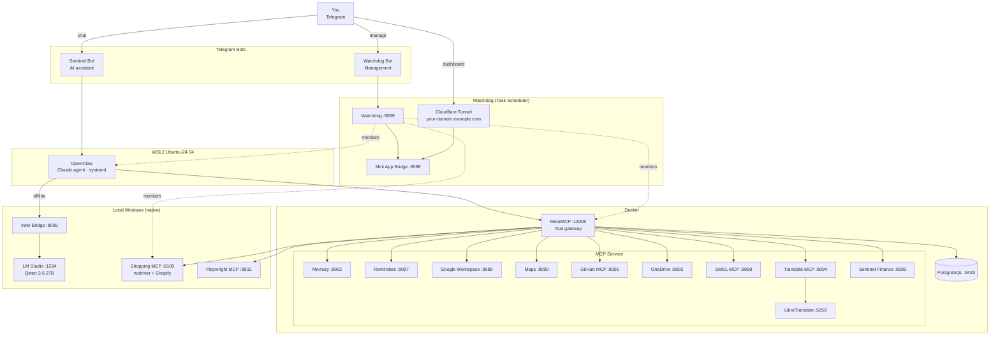

```
You (Telegram)
      │
      ▼
 OpenClaw  (Claude agent, WSL2 Ubuntu-24.04)
      │
      ▼
 MetaMCP :12008  ── aggregates all MCP tools
      │
      ├── Memory MCP        :8092   long-term recall
      ├── Reminders MCP     :8087   scheduled Telegram messages
      ├── Maps MCP          :8090   Google Maps directions & search
      ├── yt-dlp MCP        :8088   YouTube / Instagram / TikTok downloads
      ├── Google Workspace  :8089   Drive, Calendar, Gmail
      ├── GitHub MCP        :8091   repos, issues, PRs, code search
      ├── OneDrive MCP      :8093   Excel, Word, PDF via OneDrive
      ├── Translate MCP     :8094   language detection + translation
      └── LM Studio         :1234   local model (offline inference)

 Inference Bridge  :8095  ── transparent LM Studio proxy + spike detection
 PostgreSQL        :9433  ── MetaMCP database

 Watchdog Bot ──────────────────────────────────────────────────────────
      │  manages & monitors everything above
      ├── Status HTTP server  :8099
      ├── Mini App bridge     :8098   Telegram dashboard (2FA-gated)
      └── Cloudflare Tunnel   your-domain.example.com → :8098
```

All ports are bound to `127.0.0.1` only. External access goes exclusively through Cloudflare Tunnel.

---

## What you can do

| Say something like… | What happens |
|---|---|
| "What's on my Google Calendar this week?" | Google Workspace MCP reads your calendar |
| "Remind me to take medication every day at 8am" | Reminders MCP creates a cron job |
| "Download this YouTube video" | yt-dlp MCP downloads it to `G:\YT-DLP` |
| "Translate this paragraph to Chinese" | Translate MCP → LibreTranslate (local, offline) |
| "Remember that I prefer window seats on flights" | Memory MCP stores it, recalled automatically |
| "Show me directions from home to the airport" | Maps MCP → Google Maps Directions API |
| "Open a GitHub issue for this bug" | GitHub MCP creates the issue |
| "Summarise this PDF from my OneDrive" | OneDrive MCP fetches + Azure DocIntel parses |
| `/dashboard` | Bot sends inline button → opens the Mini App |

---

## Screenshots

<table>
  <tr>
    <td align="center"><b>Home</b><br>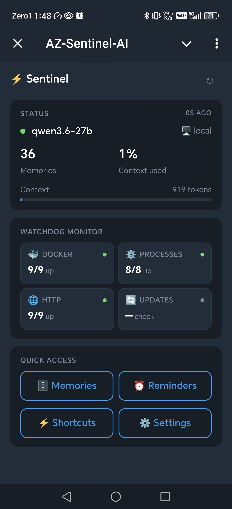</td>
    <td align="center"><b>Docker</b><br>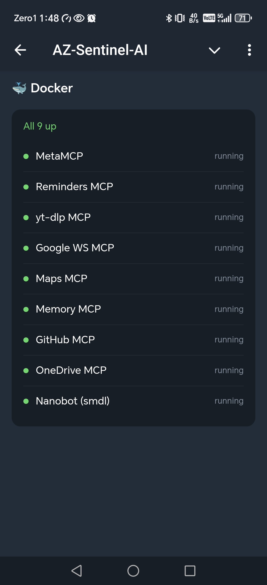</td>
    <td align="center"><b>Processes</b><br>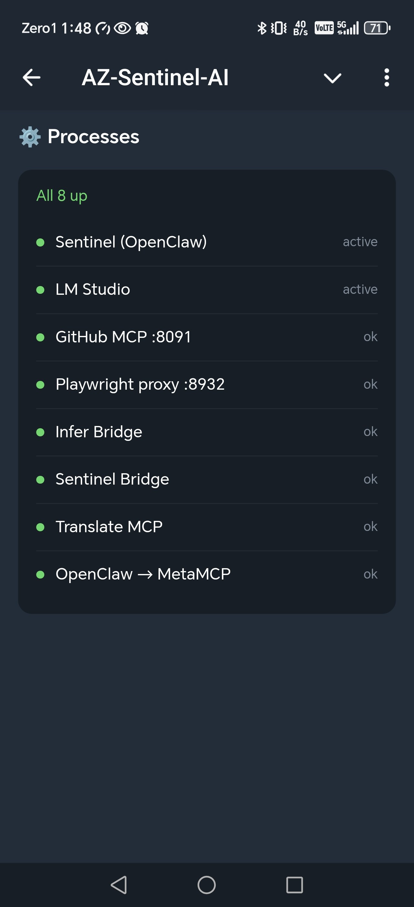</td>
    <td align="center"><b>HTTP Endpoints</b><br>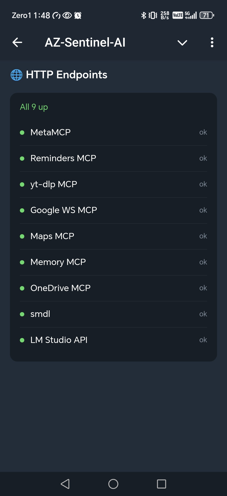</td>
  </tr>
  <tr>
    <td align="center"><b>Updates</b><br>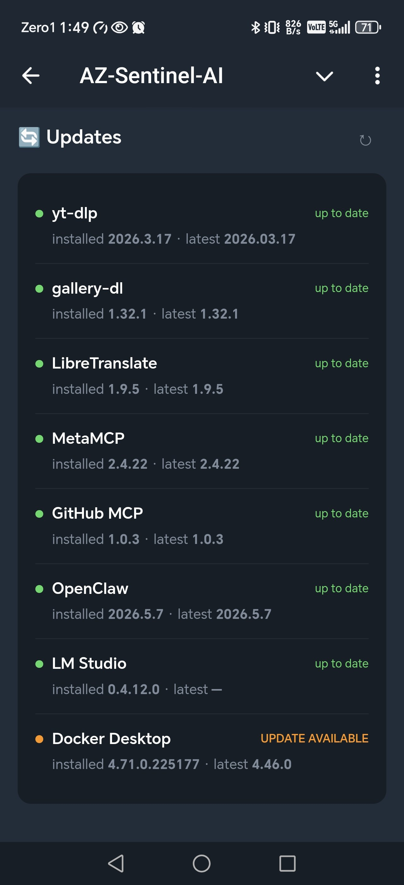</td>
    <td align="center"><b>Memories</b><br>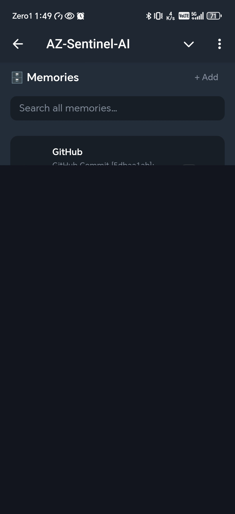</td>
    <td align="center"><b>Reminders</b><br>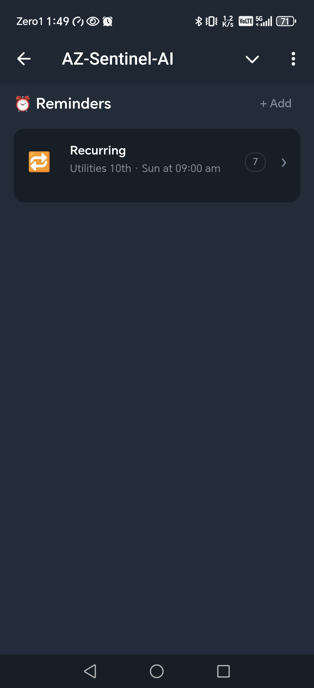</td>
    <td align="center"><b>Shortcuts</b><br>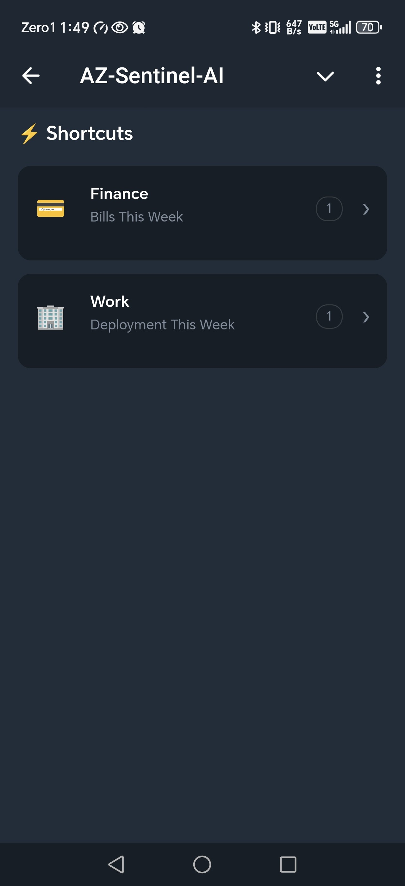</td>
  </tr>
  <tr>
    <td align="center"><b>Settings</b><br>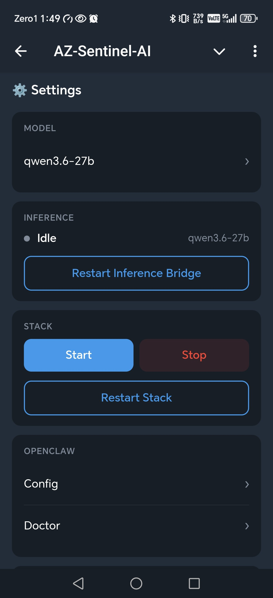</td>
    <td align="center"><b>OpenClaw Config</b><br>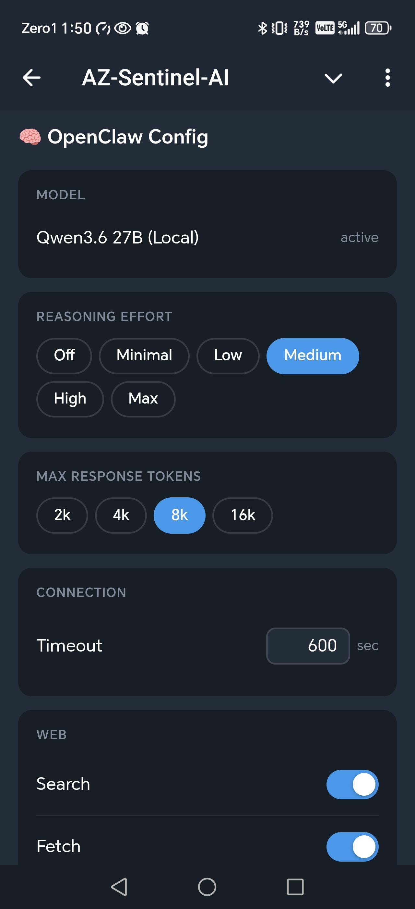</td>
    <td align="center"><b>Skills</b><br>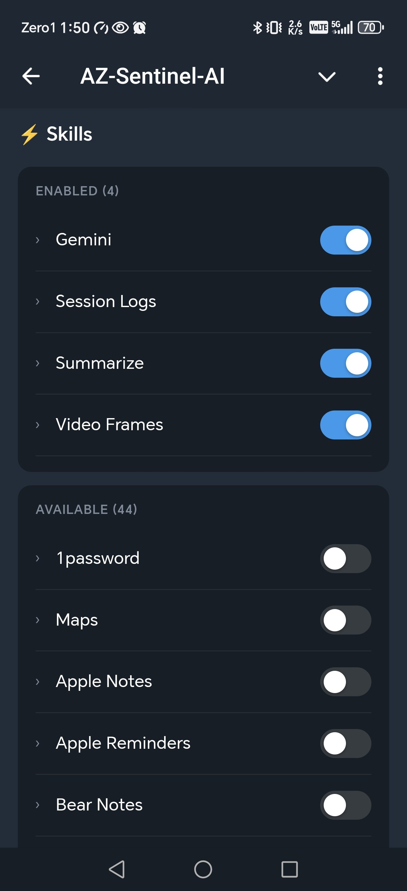</td>
    <td align="center"><b>Skill Credentials</b><br>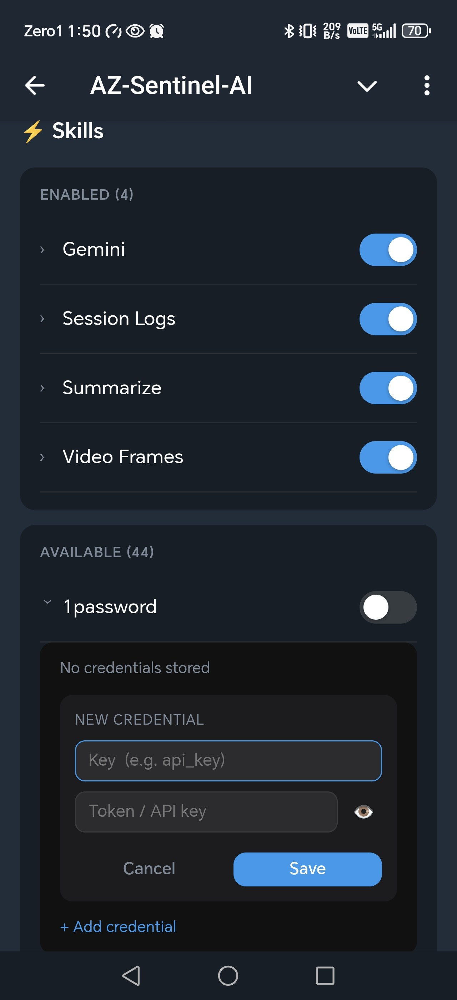</td>
  </tr>
</table>

---

## Quick start

```powershell
# Full start (Docker + OpenClaw + LM Studio + bridges)
scripts\START_AI_STACK.bat

# Stop everything
scripts\STOP_AI_STACK.bat

# Restart
scripts\RESTART_AI_STACK.bat
```

---

## First-time setup

### Prerequisites

- Windows 11 with WSL2 enabled
- Docker Desktop
- Python 3.11+ (`py` launcher)
- Node.js + npm (for OpenClaw in WSL2)
- LM Studio — `winget install ElementLabs.LMStudio`
- Cloudflare Tunnel (for Mini App public URL)

### Steps

1. **Clone the repo**
   ```powershell
   git clone https://github.com/azfarh95/sentinel-stack-public.git metamcp-local
   cd metamcp-local
   ```

2. **Copy config templates**
   ```powershell
   copy config.example.json config.json
   copy watchdog\config.example.json watchdog\config.json
   ```

3. **Set up `.env.local`**
   ```
   POSTGRES_PASSWORD=<choose a password>
   BETTER_AUTH_SECRET=<random hex>
   GITHUB_PAT=<your GitHub PAT>
   ```

4. **Store secrets in Credential Manager**
   ```powershell
   .\scripts\setup_secrets.ps1
   ```
   See [Config & Secrets](docs/config.md) for full details.

5. **Install WSL2 + OpenClaw**
   ```bash
   wsl --install Ubuntu-24.04
   # then inside WSL:
   npm install -g --prefix ~/.npm-global openclaw
   ```

6. **Start the stack**
   ```powershell
   scripts\START_AI_STACK.bat
   ```

7. **TOTP setup** — on first bridge start, open `sentinel-miniapp-v2/totp_setup.html` locally and scan the QR code with Google Authenticator.

---

## Compose file layering

The repo contains several compose files. Only one is canonical for our deployment:

| File | Status | When |
|---|---|---|
| `docker-compose.local.yml` | **Canonical — run this one** | Always. The `START_AI_STACK.bat` script uses it. |
| `docker-compose.smdl.yml` | Additive overlay | Always (SMDL downloader, runs alongside `.local.yml`) |
| `docker-compose.firefly.yml` | Additive overlay | Always (Firefly III personal finance, runs alongside `.local.yml`) |
| `docker-compose.yml` | **Upstream MetaMCP vendor file — do not run** | Reference only. Has hardcoded fallback secrets that exist for upstream demo purposes. We use `.local.yml` which removes those fallbacks via `${VAR:?}` fail-fast syntax. |
| `docker-compose.dev.yml` / `.test.yml` | MetaMCP development | Not used in our deployment |

**Why the failsafe matters:** running `docker compose up` (default file) on a fresh clone without `.env.local` will fail clearly with `POSTGRES_PASSWORD must be set in .env.local` rather than silently booting on `m3t4mcp`. Same for `BETTER_AUTH_SECRET`.

**Secrets flow:**
- `.env.local.template` is committed (placeholders only)
- `.env.local` is gitignored, generated at boot by `scripts\sync_env_from_wcm.ps1`
- Real secret values live in Windows Credential Manager (service: `sentinel-miniapp`)
- Sync script atomic-writes `.env.local` from WCM before each `docker compose up`

---

## Migrating to a new machine

```powershell
scripts\export-sentinel.ps1           # full export (~5-10 GB)
scripts\export-sentinel.ps1 -SkipWsl  # skip WSL export, re-setup fresh
```

On the new machine follow the generated `RESTORE.md`, then re-store secrets via `setup_secrets.ps1`.

---

## Known issues

Tracked at: https://github.com/azfarh95/sentinel-stack-public/issues

---

## Built on

- [MetaMCP](https://github.com/metatool-ai/metamcp) — MCP aggregation gateway
- [OpenClaw](https://openclaw.dev) — Claude-powered agent framework
- [yt-dlp](https://github.com/yt-dlp/yt-dlp) — video/photo downloader
- [gallery-dl](https://github.com/mikf/gallery-dl) — image gallery downloader
- [LibreTranslate](https://github.com/LibreTranslate/LibreTranslate) — offline translation engine
- [LM Studio](https://lmstudio.ai) — local model runner
- [GitHub MCP](https://github.com/github/github-mcp-server) — GitHub tool server

---

> **SMDL** — a standalone, non-AI Telegram bot for direct media downloads via yt-dlp and gallery-dl. Lives in its own repo: [YOUR_GITHUB_USERNAME/smdl](https://github.com/YOUR_GITHUB_USERNAME/smdl). Not part of the Sentinel AI stack.

---

## License

Sentinel AI Stack is licensed under the **Apache License 2.0** — see [LICENSE](LICENSE) and [NOTICE](NOTICE) for details.

You are free to:
- Use Sentinel for any purpose, including commercial
- Modify it and distribute your modifications
- Embed it in proprietary products
- Self-host, fork, or operate as a service

You must:
- Retain copyright + license notices in source distributions
- State significant changes you made
- Pass on the NOTICE file with your distribution

The Apache 2.0 license includes an explicit patent grant + retaliation clause that protects users.

## Contributing

PRs welcome. See [CONTRIBUTING.md](CONTRIBUTING.md) for the contributor journey. Especially helpful:

- **Documentation fixes** — typos, clearer setup steps, missing edge cases
- **Linux host support** — currently Windows-first (community-maintained beyond that)
- **New MCP servers** — wrap a tool you use into an MCP, list it here
- **Setup script improvements** — anything that reduces "first run" friction

If you have a question or want to discuss an idea, open a [Discussion](https://github.com/azfarh95/sentinel-stack-public-public/discussions) before a PR for non-trivial changes.
